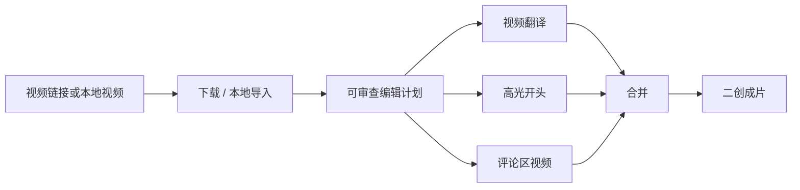

# LogicCut

> **不只是视频翻译，而是面向创作者的 AI Video Repurposing Agent。**

LogicCut 是一个开源的 **AI 视频二创工作流工具**。你可以把一个本地视频或已授权的视频链接交给 Codex，让 Codex 调用 LogicCut 完成下载、翻译、字幕、配音、高光开头、评论区素材、视频合并等步骤，最终输出一个更适合二次创作发布的视频。

LogicCut 不是「又一个视频翻译工具」，也不是「又一个下载器」。它的目标是把创作者真实工作流串起来：导入视频、理解内容、找到爆点主题、剪出高光开头、翻译/字幕/配音、分析评论区，再合并成可以继续发布和二创的视频素材。

## 直接让 Codex 使用

LogicCut 的设计方式是 **Codex 驱动**。普通用户不需要先理解每个脚本怎么跑，最简单的方式是：打开 Codex，把这个仓库链接发给它，让它安装项目、检查环境、按任务推荐模型，并运行你需要的视频流程。

可以直接复制这段话给 Codex：

```text
请安装并使用这个项目：https://github.com/piedpiperG/LogicCut

先阅读 README.md、AGENTS.md、INSTALL.md 和 docs/codex-quickstart.md。
然后执行标准安装，不要默认安装 lite 版本；不要提交任何 key、cookies、模型权重或生成视频。

我要输入一个视频链接或本地视频，请帮我完成：
1. 下载或导入视频；
2. 做视频翻译，默认本地部署模型和服务；
3. 按主题剪一个 15-30 秒高光开头；
4. 可选抓取评论区并做评论视频；
5. 最后把多段视频合并为一个二创成片。

如果我的任务需要额外模型，请先给我推荐选择和原因：
- 翻译到中文、希望轻量本地跑：优先使用 rgad-tts；
- 多语言配音：推荐 OmniVoice；
- 中文音质优先：推荐 IndexTTS2；
- 已有 FishAudio / Fish Speech S2 服务：可接 fishaudio 或 fish-speech-s2；
- 多说话人视频：再安装 pyannote。
```

Codex 负责推理、规划和执行；LogicCut 提供可复现的 CLI、本地模型栈、媒体处理管线和项目结构。本仓库不内置模型权重，Codex 应根据文档中的 GitHub / Hugging Face 来源，在用户本机下载或检查所需模型。

<p align="center">
  
  
  
  
  
  
</p>

<p align="center">
  
</p>

<p align="center">
  
</p>

## Demo 展示

| 场景 | 预览 | LogicCut 输出 |
| --- | --- | --- |
| 高光开头 |  | 围绕一个主题剪出 15-30 秒 creator hook，带字幕和可编辑 cut plan。 |
| 评论区二创 |  | 把公开评论转成视频素材，可用于评论总结、反应视频或观点引导。 |
| 本地化翻译草稿 |  | 输出翻译字幕视频；配置 TTS 后可继续生成配音版本。 |
| 视觉模板 |  | 用 HTML/card-style 模板制作片头、章节卡片、解释页和信息层。 |

当前 LogicCut 支持四类核心输出：**高光开头**、**本地化视频草稿**、**评论区二创片段**、**最终合并视频**。

## 项目定位

很多开源视频工具只解决单点问题：下载、字幕、翻译或切片。LogicCut 关注的是创作者的完整视频二创流程：

1. 导入本地视频或已授权的视频链接。
2. 理解原视频内容。
3. 选择适合传播的主题角度。
4. 剪出带字幕的高光片段。
5. 把公开评论区变成额外视频素材。
6. 把翻译、剪辑、评论等片段合并成一个二创成片。

长期目标是：**让 Codex 学会一种视频二创逻辑，然后把这套逻辑迁移到更多视频上。**

## Local-First 本地模型栈

LogicCut 的视频翻译模块默认按「本机项目 + 本地模型服务」组织：媒体处理、ASR、说话人识别、字幕、TTS 配音都优先在用户机器上运行。文本翻译默认使用 Codex 文件驱动或用户本机配置的大模型服务；如果要接云端 API，需要用户显式配置。

LogicCut 不内置模型权重，只记录模型来源和项目来源，方便 Codex 在用户本机按需安装。

| 环节 | 本地模型 / 项目 | 作用 |
| --- | --- | --- |
| 视频导入 | [`yt-dlp`](https://github.com/yt-dlp/yt-dlp) | 下载已授权的 YouTube / Bilibili 视频和 metadata。 |
| 媒体处理 | FFmpeg / FFprobe | 切片、重编码、烧录字幕、合并视频。 |
| 本地 ASR | [`faster-whisper`](https://github.com/SYSTRAN/faster-whisper)、[`faster-whisper-base`](https://huggingface.co/Systran/faster-whisper-base)、[`faster-whisper-large-v3`](https://huggingface.co/Systran/faster-whisper-large-v3) | 为真实视频生成带时间轴的 transcript。 |
| 说话人识别 | [`pyannote/speaker-diarization-3.1`](https://huggingface.co/pyannote/speaker-diarization-3.1) | 本地多说话人分段，用于多角色配音。 |
| 翻译驱动 | Codex-file workflow / 本地 `qwen35_plus` 风格 provider | 翻译分段文本并保留时间轴；Codex-file 路径不要求用户额外配置 hosted LLM key。 |
| 配音管线 | 本地 `video-translate-refine` adapter | 编排 ASR、diarization、translation、TTS、对齐、混音和字幕导出。 |
| 字幕渲染 | `subcap`-style ASS + FFmpeg/libass | 输出更统一的中文字幕、SRT 和烧录字幕视频。 |
| 高光剪辑 | AI-Shorts / auto-editor 参考 adapter + Codex plans | 生成主题开头和 semantic highlight cut plan。 |
| 评论素材 | Bilibili public API、`yt-dlp`、Playwright | 抓取公开评论和真实评论区截图。 |

## 多 TTS 后端支持

LogicCut 支持多个本地 TTS 输出后端。面向中文用户和小机器本地部署，默认优先推荐 **[RGAD Cross-Lingual TTS](https://github.com/piedpiperG/rgad-crosslingual-tts)**。

| Engine | 选择参数 | 默认端口 | 适合场景 | 来源 |
| --- | --- | --- | --- | --- |
| RGAD Cross-Lingual TTS | `rgad-tts` | `127.0.0.1:8393` | 轻量本地跨语言配音，尤其适合外语 prompt audio 克隆音色后翻译到中文。 | [GitHub](https://github.com/piedpiperG/rgad-crosslingual-tts)、[Hugging Face](https://huggingface.co/isabeth/rgad-crosslingual-tts) |
| FishAudio / Fish Speech S2 | `fishaudio` 或 `fish-speech-s2` | `127.0.0.1:8321` / `127.0.0.1:8392` | 更高质量本地 TTS、Fish Speech native adapter 实验。 | [GitHub](https://github.com/fishaudio/fish-speech) |
| IndexTTS2 | `indextts2` | `127.0.0.1:8304` | 中文合成、参考音色、情绪控制和更强中文发音。 | [GitHub](https://github.com/index-tts/index-tts)、[Hugging Face](https://huggingface.co/IndexTeam/IndexTTS-2) |
| OmniVoice / OmniVoice Studio | `omnivoice` | `127.0.0.1:8391` | 多语言 TTS 实验、OpenAI-compatible audio endpoint 集成。 | [OmniVoice](https://github.com/k2-fsa/OmniVoice)、[OmniVoice Studio](https://github.com/debpalash/OmniVoice-Studio) |

轻量中文配音推荐配置：

```bash
LOGICCUT_TTS_ENGINE=rgad-tts
LOGICCUT_TTS_PORTS=8393

logiccut translate-video \
  --input source.mp4 \
  --output-dir output/my-case/translation \
  --tts-engine rgad-tts \
  --clip 120 \
  --tgt-lang 中文
```

## 核心功能

| 功能 | 状态 | 说明 |
| --- | --- | --- |
| 本地视频输入 | Ready | 新用户优先从本地视频开始。 |
| 视频合并 | Ready | `logiccut merge` 会用 FFmpeg 统一视频/音频流。 |
| CLI 工作流 | Ready | `capabilities`、`guide`、`doctor`、`sample`、`plan`、`execute`、`merge`。 |
| YouTube / Bilibili 链接导入 | Beta | 基于 `yt-dlp`；只应处理已授权或合法允许处理的内容。 |
| 评论区抓取和分析 | Beta | 支持公开评论、评论截图、单条评论视觉素材。 |
| 评论转视频 | Beta | 支持评论截图定格视频和可选旁白流程。 |
| 高光开头 | Beta | Codex 辅助选择主题，生成 15-30 秒 opener。 |
| 视频翻译 | Beta | 内置 Codex-file 字幕翻译；配音依赖本地 ASR/TTS 后端。 |
| 多 TTS 后端 | Experimental | 推荐 RGAD Cross-Lingual TTS；可选 FishAudio / IndexTTS2 / OmniVoice。 |
| 一条命令 `create` | Experimental | `plan` + `execute` 的快捷入口，真实项目建议先审查 plan。 |
| 剪辑逻辑学习 | Roadmap | 把学到的二创逻辑迁移到不同视频。 |
| Web UI | Roadmap | 后续提供更易用的时间线审查和交互界面。 |

## 当前边界

LogicCut 目前处于 public preview。推荐首次路径是标准安装、本地视频输入、评论快切、翻译依赖检查和视频合并。`lite` 只保留给极小范围的安装问题排查。

一些工作流依赖外部服务或平台可用性：

- 链接导入可能需要 cookies，也可能受平台规则变化影响。
- 内置视频翻译目前优先输出翻译字幕视频；完整配音需要配置本地 ASR / TTS 后端。
- 高光开头对长视频、复杂叙事的稳定性仍在改进。
- 评论转视频目前以评论截图定格和旁白视频为主。
- 暂无完整 Web UI，当前是 CLI-first、Codex-friendly。

如果工作流失败，请在 issue 中提供命令、日志、视频来源类型和期望输出。

## 快速开始

### 1. 安装

Linux / macOS：

```bash
git clone https://github.com/piedpiperG/LogicCut.git
cd LogicCut

./scripts/install.sh
source .venv/bin/activate
logiccut doctor --profile standard --json
```

Windows PowerShell：

```powershell
git clone https://github.com/piedpiperG/LogicCut.git
cd LogicCut

powershell -ExecutionPolicy Bypass -File scripts/install.ps1
.venv\Scripts\Activate.ps1
python -m logiccut.cli doctor --profile standard --json
```

### 2. 安装烟测

```bash
logiccut capabilities
logiccut guide --task remix
logiccut sample --output output/sample/a.mp4 --duration 1
logiccut sample --output output/sample/b.mp4 --duration 1
logiccut merge \
  --inputs output/sample/a.mp4 output/sample/b.mp4 \
  --output output/sample/final_remix.mp4
```

这条路径不依赖视频平台、cookies、API key 或模型服务，只验证安装、FFmpeg、音视频流处理和 CLI 调用是否正常。

### 3. 本地二创开头 Demo

这条路径会从生成的本地视频渲染一个 tiny theme opener，并生成可审查的 edit plan。fallback transcript 只用于首次安装验证，真实视频应使用真实 ASR。

```bash
logiccut sample --output output/theme-opener-sample/source.mp4 --duration 35

logiccut init \
  --input output/theme-opener-sample/source.mp4 \
  --project-dir output/theme-opener-sample/project \
  --title "Local Theme Opener Demo"

LOGICCUT_ALLOW_TRANSCRIPT_FALLBACK=1 \
logiccut run --project-dir output/theme-opener-sample/project --recipe theme-opener
```

第一次运行会写出 Codex prompt：

```text
output/theme-opener-sample/project/assets/theme_opener/codex_prompt.md
```

复制仓库内示例 plan 后再次渲染：

```bash
cp examples/theme-opener-local-sample-plan.json \
  output/theme-opener-sample/project/assets/theme_opener/theme_opener_plan.json

LOGICCUT_ALLOW_TRANSCRIPT_FALLBACK=1 \
logiccut run --project-dir output/theme-opener-sample/project --recipe theme-opener
```

输出：

```text
output/theme-opener-sample/project/renders/theme_opener/theme_opener.mp4
output/theme-opener-sample/project/assets/theme_opener/theme_opener_report.html
```

### 4. 已授权视频链接

先生成可审查 plan：

```bash
logiccut plan \
  --url "https://www.youtube.com/watch?v=96jN2OCOfLs" \
  --project-dir output/my-case \
  --tasks download,comments,comment-freeze,merge \
  --target-lang 中文 \
  --theme auto \
  --comment-duration 20
```

执行前先 dry-run：

```bash
logiccut execute --plan output/my-case/logiccut_plan.json --dry-run
```

确认后执行：

```bash
logiccut execute --plan output/my-case/logiccut_plan.json
```

### 5. 本地视频翻译

这条路径使用 LogicCut 内置的文件式翻译流程：Codex 读取生成的 prompt，写入 `translated_segments.json`，用户不需要另外配置 hosted LLM API key。

```bash
logiccut setup translation --profile asr --dry-run

logiccut translate-video \
  --backend logiccut-local \
  --input output/my-case/source.mp4 \
  --output-dir output/my-case/translation \
  --clip 90 \
  --tgt-lang 中文
```

真实视频需要本地 ASR。Codex 可以执行 `logiccut setup translation --profile asr --install`，也可以使用用户已有 transcript：

```bash
logiccut translate-video \
  --backend logiccut-local \
  --input output/my-case/source.mp4 \
  --output-dir output/my-case/translation \
  --transcript-json output/my-case/source_transcript.json \
  --clip 90 \
  --tgt-lang 中文
```

第一次运行会写出：

```text
output/my-case/translation/codex_translation_prompt.md
output/my-case/translation/translated_segments.todo.json
```

Codex 写入 `translated_segments.json` 后，再次运行渲染：

```bash
logiccut translate-video \
  --backend logiccut-local \
  --input output/my-case/source.mp4 \
  --output-dir output/my-case/translation \
  --translation-json output/my-case/translation/translated_segments.json \
  --clip 90 \
  --tgt-lang 中文
```

更多细节见 [docs/local-translation.md](docs/local-translation.md) 和 [examples/public-video-translation-case.json](examples/public-video-translation-case.json)。

### 6. 本地配音

轻量中文配音推荐 RGAD Cross-Lingual TTS：

```bash
LOGICCUT_TTS_ENGINE=rgad-tts
LOGICCUT_TTS_PORTS=8393

logiccut translate-video \
  --backend video-translate-refine \
  --input output/my-case/source.mp4 \
  --output-dir output/my-case/dubbed \
  --clip 120 \
  --tgt-lang 中文 \
  --tts-engine rgad-tts \
  --burn-subtitles
```

如果用户明确要多语言配音，Codex 应推荐 OmniVoice；如果更重视中文音质，推荐 IndexTTS2；如果用户已有 FishAudio / Fish Speech S2 服务，则复用对应后端。

### 7. 合并已有片段

```bash
logiccut merge \
  --inputs opener.mp4 translated.mp4 comments.mp4 \
  --output output/my-case/final/final_remix.mp4
```

## Codex 工作流

LogicCut 可以手动运行，也可以由 Codex、Claude Code 或其他 coding agent 控制。agent 应先阅读 [AGENTS.md](AGENTS.md)，再按这个顺序执行：

1. `logiccut capabilities`
2. `logiccut doctor --profile standard --json`
3. `logiccut guide --task remix`
4. `logiccut plan ...`
5. 审查并必要时修改 `logiccut_plan.json`
6. `logiccut execute --plan ...`
7. `logiccut merge ...`
8. 用 `ffprobe` 验证最终视频流

详细流程见 [docs/codex-quickstart.md](docs/codex-quickstart.md)。

## Recipes 和示例

发布示例存放在 [examples/](examples/) 和 [recipes/](recipes/)：

- `recipes/remix-lite.json`：link → comments → comment fast-cut → merge。
- `recipes/theme-opener.json`：local video → Codex theme opener。
- `recipes/comment-fast-cut.json`：comments JSON → 20s fast comment recap。
- `examples/v03-lite-remix-plan.json`：示例 `logiccut_plan.json`。
- `examples/public-video-translation-case.json`：90 秒公开视频翻译验收 case。

## 架构



## 同类项目对比

| 项目类型 | 常见重点 | LogicCut 定位 |
| --- | --- | --- |
| VideoLingo / pyVideoTrans | 翻译、字幕、配音 | LogicCut 可以调用翻译后端，但更关注二创工作流。 |
| yt-dlp | 下载媒体 | LogicCut 把链接导入作为输入方式，不把下载本身当作产品故事。 |
| MoneyPrinterTurbo | 从 prompt 生成新短视频 | LogicCut 更关注把已有视频改造成新的二创内容。 |
| OpusClip-style tools | 自动短视频切片 | LogicCut 强调 Codex reasoning、评论区素材和可组合 recipes。 |

## 负责任使用

LogicCut 设计用于处理你拥有、获得授权或法律允许转换的视频。链接导入和公开评论分析用于创作者工作流、研究、备份和可访问性场景。你需要自行遵守平台条款、版权法、隐私要求和所在地法律法规。

不要提交或公开：

- `.env.local`
- API keys
- cookies
- Hugging Face tokens
- 模型权重
- 包含私人或受版权保护内容的生成视频

公开使用评论截图时，建议模糊用户名、头像和其他个人信息。

## 安装 Profile

| Profile | 使用场景 | 命令 |
| --- | --- | --- |
| `standard` | 推荐默认安装：下载、评论、截图、合并、OpenCC、基础二创工具 | `./scripts/install.sh` |
| `full` | Linux / WSL2 重模型环境；Codex 解释任务级模型选择后再使用 | `./scripts/install.sh --profile full` |
| `lite` | 调试烟测；不推荐普通用户使用 | `./scripts/install.sh --profile lite` |

标准安装不会内置或下载模型权重。真实任务中，Codex 应先推荐匹配的模型栈，再只安装需要的可选模型服务。

## 已验证环境

当前 release candidate 已在以下环境中验证：

| 项目 | 版本 / 说明 |
| --- | --- |
| OS | Ubuntu-style Linux；Windows GPU 工作推荐 WSL2。 |
| Python | 3.10+ |
| FFmpeg / FFprobe | 所有媒体工作流都需要。 |
| Browser automation | Playwright 用于真实评论区截图。 |
| Standard profile | 下载、评论、截图、sample 生成、合并、OpenCC、本地 theme-opener demo。 |
| Full profile | 翻译和 TTS adapter 依赖额外模型服务，按部署环境处理。 |

## 开发验证

```bash
python3 -m pytest -q
bash -n scripts/install.sh scripts/logiccut.sh scripts/env.sh
python3 -m py_compile scripts/bootstrap.py logiccut/*.py
```

当前 release-candidate 验证结果：

```text
153 passed
```

## Roadmap

- 更好的主题推荐和多主题选择。
- 更稳定的字幕样式 presets。
- 评论区素材的隐私保护和自动模糊。
- 更可靠的长视频 semantic highlight 选择。
- 可学习的 editing recipes，把创作者风格迁移到新视频。
- 可选 Web UI 和时间线审查。

## 参与和反馈

如果 LogicCut 对你的创作工作流有帮助，GitHub star 可以帮助更多人发现项目。真实案例、recipes、bug reports 和失败样例都很有价值。
