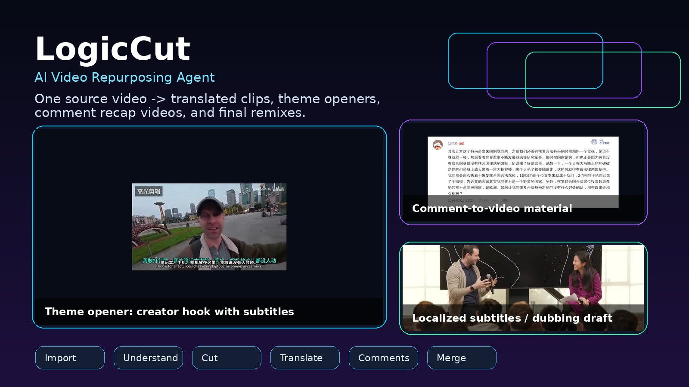
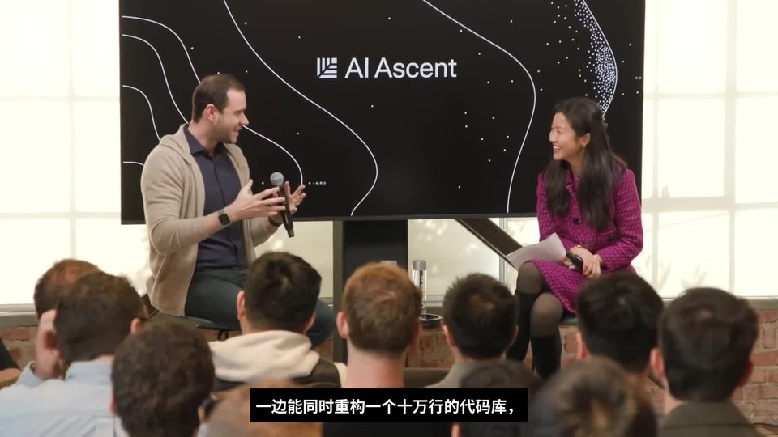
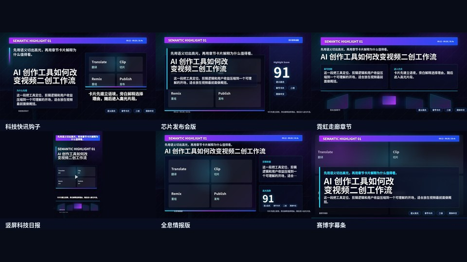
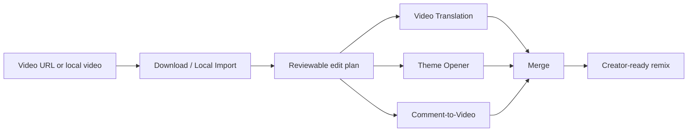

# LogicCut

> **Don’t just translate videos. Repurpose them.**

LogicCut is an open-source **AI Video Repurposing Agent** for creator workflows. Give it a local video or an authorized video link, and it helps turn the source into translated videos, theme-based highlight openers, comment-recap clips, and composed creator-ready shorts.

LogicCut 不是「又一个视频翻译工具」，也不是「又一个下载器」。它的目标是把创作者真实工作流串起来：导入视频、理解内容、找到爆点主题、剪出高光开头、翻译/字幕/配音、分析评论区，再合并成可以继续发布和二创的视频素材。

## Use It With Codex

LogicCut is designed to be driven by Codex. The simplest user experience is: open Codex on your machine, give it this repository link, and ask it to install the project, check the environment, download the needed local models, and run the workflow you want.

Recommended prompt:

```text
请安装并使用这个项目：https://github.com/piedpiperG/LogicCut

先阅读 README.md、AGENTS.md、INSTALL.md 和 docs/codex-quickstart.md。
然后在本机配置环境，不要提交任何 key、cookies、模型权重或生成视频。

我要输入一个视频链接或本地视频，请帮我完成：
1. 下载或导入视频；
2. 做视频翻译，默认本地部署模型和服务；
3. 按主题剪一个 15-30 秒高光开头；
4. 可选抓取评论区并做评论视频；
5. 最后把多段视频合并为一个二创成片。
```

Codex is the reasoning and orchestration layer; LogicCut provides the reproducible CLI, local model stack, media pipeline, and project structure. The repository does not include model weights. Codex should download or verify external models from the documented GitHub / Hugging Face sources on the user's machine.

<p align="center">
  
  
  
  
  
  
</p>

<p align="center">
  
</p>

<p align="center">
  
</p>

## Demo Gallery

| Scenario | Preview | What LogicCut Produces |
| --- | --- | --- |
| Theme opener |  | A 15-30s creator hook around one angle, with subtitles and an editable cut plan. |
| Comment recap |  | Public comments become fast visual material for recap or reaction videos. |
| Localized draft |  | A translated/subtitled video draft, with optional dubbing when TTS is configured. |
| Visual templates |  | HTML/card-style creator overlays for intros, chapters, and explanations. |

LogicCut currently supports four creator outputs: **theme openers**, **localized video drafts**, **public-comment recap clips**, and **final remix composition**.

## Local-First Model Stack

LogicCut 的视频翻译模块默认按「本机项目 + 本地模型服务」组织：媒体处理、ASR、说话人识别、字幕、TTS 配音都优先在用户机器上运行。文本翻译默认使用 Codex 文件驱动或用户本机配置的大模型服务；如果要接云端 API，需要用户显式配置。

LogicCut does not vendor model weights. It records the source projects and model links so Codex can install or check them on the user's machine.

| Stage | Local Model / Project | What It Does |
| --- | --- | --- |
| Video import | [`yt-dlp`](https://github.com/yt-dlp/yt-dlp) | Download authorized YouTube / Bilibili videos and metadata. |
| Media processing | FFmpeg / FFprobe | Cut clips, normalize streams, burn subtitles, merge final videos. |
| Local ASR | [`faster-whisper`](https://github.com/SYSTRAN/faster-whisper), [`faster-whisper-base`](https://huggingface.co/Systran/faster-whisper-base), [`faster-whisper-large-v3`](https://huggingface.co/Systran/faster-whisper-large-v3) | Generate timed transcripts for real videos. |
| Speaker diarization | [`pyannote/speaker-diarization-3.1`](https://huggingface.co/pyannote/speaker-diarization-3.1) | Local speaker segmentation for multi-speaker dubbing. |
| Translation driver | Codex-file workflow / local `qwen35_plus` style provider | Translate transcript segments while keeping timing; no separate hosted LLM key is required in the Codex-file path. |
| Dubbing pipeline | Local `video-translate-refine` adapter | Orchestrate ASR, diarization, translation, TTS, alignment, mixdown, and subtitle export. |
| Subtitle rendering | `subcap`-style ASS + FFmpeg/libass | Produce cleaner burned-in Chinese subtitles and SRT outputs. |
| Highlight clipping | AI-Shorts / auto-editor reference adapters + Codex plans | Build theme openers and semantic highlight cut plans. |
| Comment material | Bilibili public API, `yt-dlp`, Playwright | Fetch public comments and capture real comment-section screenshots. |

## Multi-Backend TTS Output

LogicCut supports multiple local TTS output backends. For small local machines and creator laptops, the first recommended backend is **[RGAD Cross-Lingual TTS](https://github.com/piedpiperG/rgad-crosslingual-tts)**.

| Engine | Selector | Default Endpoint | Best For | Source |
| --- | --- | --- | --- | --- |
| RGAD Cross-Lingual TTS | `rgad-tts` | `127.0.0.1:8393` | Lightweight foreign-prompt-to-Chinese voice-cloned dubbing on small machines. | [GitHub](https://github.com/piedpiperG/rgad-crosslingual-tts), [Hugging Face](https://huggingface.co/isabeth/rgad-crosslingual-tts) |
| FishAudio / Fish Speech S2 | `fishaudio` or `fish-speech-s2` | `127.0.0.1:8321` / `127.0.0.1:8392` | Higher-quality local TTS and Fish Speech native adapter experiments. | [GitHub](https://github.com/fishaudio/fish-speech) |
| IndexTTS2 | `indextts2` | `127.0.0.1:8304` | Chinese-focused synthesis, emotion/reference-voice experiments, stronger Chinese pronunciation. | [GitHub](https://github.com/index-tts/index-tts), [Hugging Face](https://huggingface.co/IndexTeam/IndexTTS-2) |
| OmniVoice / OmniVoice Studio | `omnivoice` | `127.0.0.1:8391` | Multilingual TTS experiments and OpenAI-compatible audio endpoint integration. | [OmniVoice](https://github.com/k2-fsa/OmniVoice), [OmniVoice Studio](https://github.com/debpalash/OmniVoice-Studio) |

RGAD Cross-Lingual TTS is designed for a practical video-translation case: use a short foreign-language prompt audio, keep the speaker timbre, and synthesize Chinese speech from translated Chinese text.

```bash
LOGICCUT_TTS_ENGINE=rgad-tts
LOGICCUT_TTS_PORTS=8393

logiccut translate-video \
  --input source.mp4 \
  --output-dir output/my-case/translation \
  --tts-engine rgad-tts \
  --clip 120 \
  --tgt-lang 中文
```

## Why LogicCut

Most open-source video tools solve one stage: download, subtitle, translate, or cut. LogicCut focuses on the creator workflow around **video repurposing**:

1. Import a local video or authorized link.
2. Understand the source content.
3. Pick a creator-oriented theme.
4. Cut and subtitle the best moments.
5. Turn public comments into additional video material.
6. Merge multiple parts into one output.

The long-term story is simple: **teach the agent a video repurposing logic once, then apply it to many new videos.**

## Core Features

| Feature | Status | Notes |
| --- | --- | --- |
| Local video input | Ready | Recommended path for first-time users. |
| Video merge | Ready | `logiccut merge` normalizes video/audio streams with FFmpeg. |
| CLI planning workflow | Ready | `capabilities`, `guide`, `doctor`, `sample`, `plan`, `execute`, `merge`. |
| YouTube / Bilibili link import | Beta | Powered by `yt-dlp`; use only for authorized or legally permitted content. |
| Public comment import / analysis | Beta | Public comments, screenshots, single-comment visual items. |
| Comment-to-video | Beta | Freeze-frame clips and optional narration workflow. |
| Theme opener | Beta | Agent-assisted theme selection and 15-30s opener rendering. |
| Video translation | Beta | Built-in Codex-file subtitle translation; optional dubbing through external ASR/TTS backends. |
| Multi-backend TTS | Experimental | Recommended: RGAD Cross-Lingual TTS for small-machine foreign-to-Chinese dubbing. Optional: FishAudio / IndexTTS2 / OmniVoice adapters. |
| One-command `create` workflow | Experimental | Convenience wrapper around `plan` + `execute`; inspect the generated plan for real projects. |
| Editing recipe learning | Roadmap | Reuse a learned editing logic across different source videos. |
| Optional Web UI | Roadmap | Timeline review and easier creator-facing interaction. |

## Current Limitations

LogicCut is currently in public preview. The recommended first-time path is local video input, comment fast-cut, and video merge.

Some workflows depend on external services or platform availability:

- Link import may require cookies or fail when platforms change their access rules.
- Built-in video translation currently focuses on translated subtitles. Dubbing still depends on optional ASR/TTS backends.
- Theme opener generation is still improving for long videos and complex narratives.
- Comment-to-video currently focuses on simple freeze-frame and narration workflows.
- There is no full Web UI yet; the project is currently CLI-first and agent-friendly.

If a workflow fails, please open an issue with the command, logs, source type, and expected output.

## Quick Start

### 1. Install

Linux / macOS:

```bash
git clone https://github.com/piedpiperG/LogicCut.git
cd LogicCut

./scripts/install.sh --profile lite
source .venv/bin/activate
logiccut doctor --profile lite --json
```

Windows PowerShell:

```powershell
git clone https://github.com/piedpiperG/LogicCut.git
cd LogicCut

powershell -ExecutionPolicy Bypass -File scripts/install.ps1 -Profile lite
.venv\Scripts\Activate.ps1
python -m logiccut.cli doctor --profile lite --json
```

### 2. Path A: Smoke Test

```bash
logiccut capabilities
logiccut guide --task remix
logiccut sample --output output/sample/a.mp4 --duration 1
logiccut sample --output output/sample/b.mp4 --duration 1
logiccut merge \
  --inputs output/sample/a.mp4 output/sample/b.mp4 \
  --output output/sample/final_remix.mp4
```

This path does not depend on a platform link, cookies, API keys, or model services.

It only verifies installation, FFmpeg, audio/video stream handling, and CLI wiring. It is not the core repurposing demo.

### 3. Path B: Local Repurposing Demo

This path renders a tiny theme opener from a generated local video and a reviewable edit plan. The fallback transcript is synthetic and exists only so first-time users can test the repurposing workflow without downloading third-party ASR models.

```bash
logiccut sample --output output/theme-opener-sample/source.mp4 --duration 35

logiccut init \
  --input output/theme-opener-sample/source.mp4 \
  --project-dir output/theme-opener-sample/project \
  --title "Local Theme Opener Demo"

LOGICCUT_ALLOW_TRANSCRIPT_FALLBACK=1 \
logiccut run --project-dir output/theme-opener-sample/project --recipe theme-opener
```

The first run writes a review prompt:

```text
output/theme-opener-sample/project/assets/theme_opener/codex_prompt.md
```

To render the local demo, copy the included editable plan and run the recipe again:

```bash
cp examples/theme-opener-local-sample-plan.json \
  output/theme-opener-sample/project/assets/theme_opener/theme_opener_plan.json

LOGICCUT_ALLOW_TRANSCRIPT_FALLBACK=1 \
logiccut run --project-dir output/theme-opener-sample/project --recipe theme-opener
```

Output:

```text
output/theme-opener-sample/project/renders/theme_opener/theme_opener.mp4
output/theme-opener-sample/project/assets/theme_opener/theme_opener_report.html
```

For real videos, use real ASR instead of `LOGICCUT_ALLOW_TRANSCRIPT_FALLBACK=1`.

### 4. Path C: Authorized Video Link

Generate a reviewable plan first:

```bash
logiccut plan \
  --url "https://www.youtube.com/watch?v=96jN2OCOfLs" \
  --project-dir output/my-case \
  --tasks download,comments,comment-freeze,merge \
  --target-lang 中文 \
  --theme auto \
  --comment-duration 20
```

Dry-run before doing network or media work:

```bash
logiccut execute --plan output/my-case/logiccut_plan.json --dry-run
```

Then execute:

```bash
logiccut execute --plan output/my-case/logiccut_plan.json
```

### 5. Path D: Local Video Translation

This path uses LogicCut's built-in file-based translation pipeline. Codex reads the generated prompt and writes `translated_segments.json`; users do not need to configure a separate LLM API key for translation.

```bash
logiccut setup translation --profile asr --dry-run

logiccut translate-video \
  --backend logiccut-local \
  --input output/my-case/source.mp4 \
  --output-dir output/my-case/translation \
  --clip 90 \
  --tgt-lang 中文
```

For real ASR on a user machine, run `logiccut setup translation --profile asr --install` or provide an existing transcript with `--transcript-json`.

The first run writes:

```text
output/my-case/translation/codex_translation_prompt.md
output/my-case/translation/translated_segments.todo.json
```

After Codex writes `translated_segments.json`, render the translated video:

```bash
logiccut translate-video \
  --backend logiccut-local \
  --input output/my-case/source.mp4 \
  --output-dir output/my-case/translation \
  --translation-json output/my-case/translation/translated_segments.json \
  --clip 90 \
  --tgt-lang 中文
```

See [docs/local-translation.md](docs/local-translation.md) and [examples/public-video-translation-case.json](examples/public-video-translation-case.json).

For local dubbing, the recommended lightweight path is RGAD Cross-Lingual TTS:

```bash
LOGICCUT_TTS_ENGINE=rgad-tts
LOGICCUT_TTS_PORTS=8393

logiccut translate-video \
  --backend video-translate-refine \
  --input output/my-case/source.mp4 \
  --output-dir output/my-case/dubbed \
  --clip 120 \
  --tgt-lang 中文 \
  --tts-engine rgad-tts \
  --burn-subtitles
```

### 6. Path E: Merge Existing Clips

```bash
logiccut merge \
  --inputs opener.mp4 translated.mp4 comments.mp4 \
  --output output/my-case/final/final_remix.mp4
```

## Agent-Friendly Workflow

LogicCut provides a CLI-native workflow that can be used manually or controlled by coding agents such as Codex, Claude Code, or other agentic development tools. An agent should read [AGENTS.md](AGENTS.md), then follow this order:

1. `logiccut capabilities`
2. `logiccut doctor --profile lite --json`
3. `logiccut guide --task remix`
4. `logiccut plan ...`
5. Review and edit `logiccut_plan.json` if needed.
6. `logiccut execute --plan ...`
7. `logiccut merge ...`
8. Verify final video streams with `ffprobe`.

See [docs/codex-quickstart.md](docs/codex-quickstart.md) for the detailed workflow.

## Recipes

Release examples are stored in [examples/](examples/) and [recipes/](recipes/):

- `recipes/remix-lite.json`: link → comments → comment fast-cut → merge.
- `recipes/theme-opener.json`: local video → Codex theme opener.
- `recipes/comment-fast-cut.json`: comments JSON → 20s fast comment recap.
- `examples/v03-lite-remix-plan.json`: an example `logiccut_plan.json`.
- `examples/public-video-translation-case.json`: 90s public-video translation acceptance case.

## Architecture



## Comparison

| Project Type | Typical Focus | LogicCut Position |
| --- | --- | --- |
| VideoLingo / pyVideoTrans | Translation, subtitles, dubbing | LogicCut can call translation backends, but focuses on repurposing workflow. |
| yt-dlp | Downloading media | LogicCut uses link import as one input method, not as the product story. |
| MoneyPrinterTurbo | Generate new short videos from prompts | LogicCut repurposes existing videos into new creator outputs. |
| OpusClip-style tools | Auto short clipping | LogicCut emphasizes reasoning cuts, comments, and composable recipes. |

## Responsible Use

LogicCut is designed for videos you own, are authorized to process, or are legally permitted to transform. Link import and public comment analysis are provided for creator workflows, research, backup, and accessibility scenarios. You are responsible for complying with platform terms, copyright law, privacy requirements, and local regulations.

Do not commit or publish:

- `.env.local`
- API keys
- cookies
- Hugging Face tokens
- model weights
- generated videos containing private or copyrighted material

When using comment screenshots in public videos, consider blurring usernames, avatars, and other personal information.

## Installation Profiles

| Profile | Use Case | Command |
| --- | --- | --- |
| `lite` | Download, comments, screenshots, merge | `./scripts/install.sh --profile lite` |
| `creator` | `lite` + extra creator tooling | `./scripts/install.sh --profile creator` |
| `full` | Translation and local model services | `./scripts/install.sh --profile full` |

Full profile depends on external model services and is best tested on Linux or WSL2 with GPU support.

## Known Working Environment

The current release candidate has been validated on:

| Item | Version / Notes |
| --- | --- |
| OS | Ubuntu-style Linux environment; WSL2 recommended for Windows GPU work. |
| Python | 3.10+ |
| FFmpeg / FFprobe | Required for every media workflow. |
| Browser automation | Playwright is used for real comment-section screenshots. |
| Lite profile | Download, comments, screenshot capture, sample generation, merge, local theme-opener demo. |
| Full profile | Translation and TTS adapters require additional model services and are best treated as deployment-specific. |

## Development

```bash
python3 -m pytest -q
bash -n scripts/install.sh scripts/logiccut.sh scripts/env.sh
python3 -m py_compile scripts/bootstrap.py logiccut/*.py
```

Expected release-candidate validation:

```text
148 passed
```

## Roadmap

- Better theme proposal UI and multi-theme selection.
- Stronger subtitle style presets.
- Privacy-safe comment rendering with optional blur.
- More reliable long-video semantic highlight selection.
- Learnable editing recipes that transfer a creator’s style to new videos.
- Optional Web UI and timeline review.

## Support

If LogicCut is useful for your workflow, a GitHub star helps others discover the project. Real examples, recipes, bug reports, and failure cases are especially welcome.
