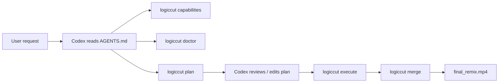

# V0.3 Codex User Workflow Plan

## 目标

V0.3 把 LogicCut 从「多个可用模块」推进到「用户可以让 Codex 调用的一站式视频二创工作流」。用户输入视频链接或本地视频，Codex 负责发现能力、检查环境、生成计划、执行模块，并把多段视频合并成最终二创视频。

## 已实现范围

| 能力 | 状态 |
| --- | --- |
| Codex 操作协议 | `AGENTS.md` 已定义默认工作顺序和安全边界。 |
| 跨平台安装说明 | `INSTALL.md` 覆盖 Linux、macOS、Windows 和 profile。 |
| 能力发现 | `logiccut capabilities` 输出机器可读功能清单。 |
| 任务向导 | `logiccut guide --task ...` 输出 Codex 可执行步骤。 |
| 环境检查 | `logiccut doctor --profile lite|creator|full --json` 输出依赖状态。 |
| 合并视频 | `logiccut merge` 支持多段视频重编码合并。 |
| 计划生成 | `logiccut plan` 写出可审查 `logiccut_plan.json`。 |
| 计划执行 | `logiccut execute` 支持 dry-run 和实际执行。 |
| 一键入口 | `logiccut create` 等价于 plan + execute。 |

## 用户流程



## 当前边界

- V0.3 的 `plan/execute/create` 是编排入口，不替代底层视频翻译质量优化。
- 视频翻译仍依赖 `video-translate-refine` 和本地服务。
- `theme-opener` 仍需要 Codex 写 `theme_opener_plan.json`。
- 生成视频默认放在 `output/`，不会提交到 Git。

## 验收方式

轻量验收：

```bash
python3 -m pytest tests/test_v03_user_workflow.py -q
logiccut sample --output output/v03-smoke/a.mp4 --duration 1
logiccut sample --output output/v03-smoke/b.mp4 --duration 1
logiccut merge --inputs output/v03-smoke/a.mp4 output/v03-smoke/b.mp4 --output output/v03-smoke/final.mp4
```

计划验收：

```bash
logiccut plan \
  --url "https://www.youtube.com/watch?v=96jN2OCOfLs" \
  --project-dir output/v03-demo \
  --tasks download,comments,comment-freeze,merge \
  --comment-duration 20

logiccut execute --plan output/v03-demo/logiccut_plan.json --dry-run
```
